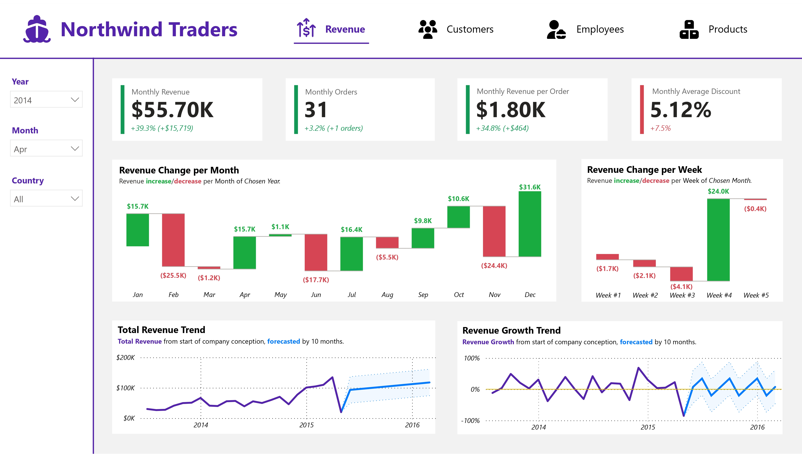
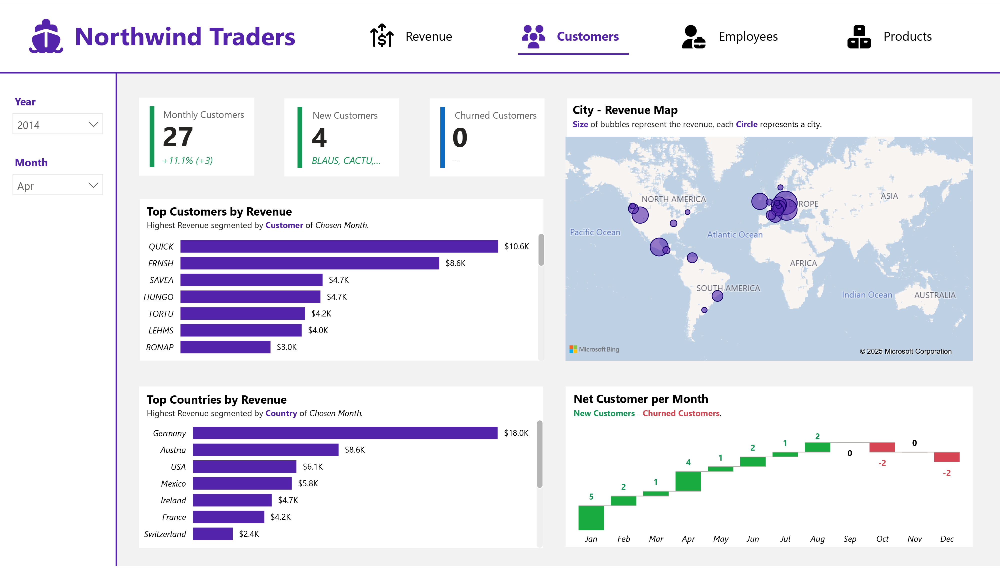
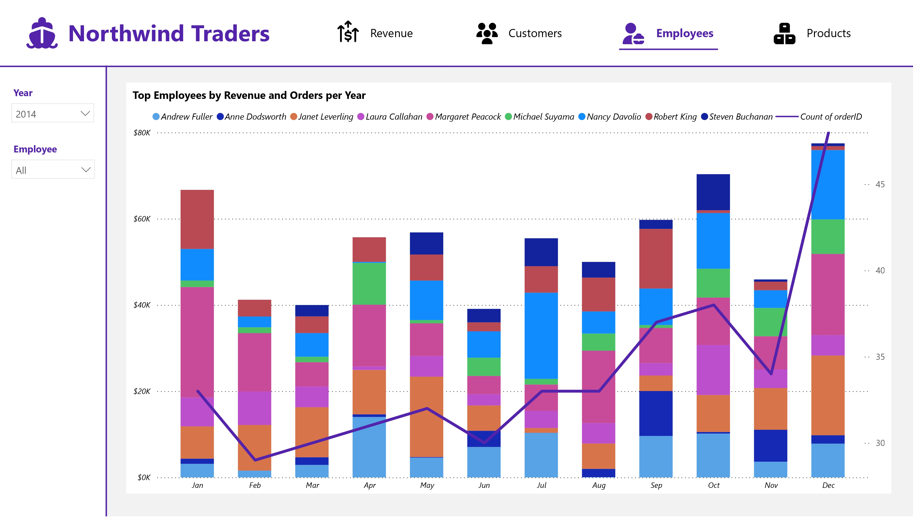
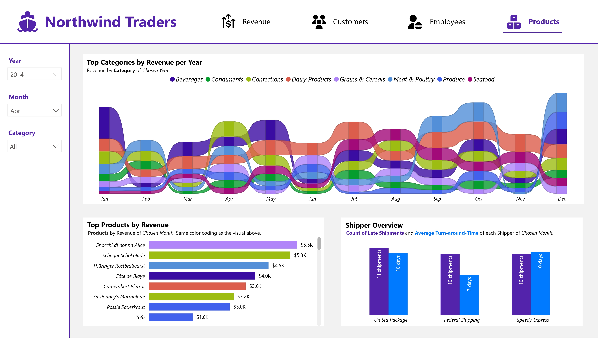

# 🚀 Northwind Traders Power BI Dashboard Project

## 🧠 Rationale
This project aims to **analyze the famous Northwind Traders dataset** using a **multi-page interactive Power BI dashboard** connected to a **MySQL database**.  
The main goal is to provide **top management** with an **at-a-glance view** of the company’s current performance — all through an interactive and visually appealing interface.  

Key focuses include:
- 🧩 Implementing **slicers** for dynamic filtering  
- 📊 Designing a **multi-page report** for organized analysis  

---

## 🎯 Project Output

### 📈 Dashboard
The dashboard is divided into **4 key pages**, each highlighting a different business area:

1. 💰 **Revenue**
2. 👥 **Customers**
3. 🧑‍💼 **Employees**
4. 📦 **Products**

  
  
  

---

### 🖱️ Interactivity Demonstration
A quick look at how the dashboard responds to user input:  

---

## 🛠️ Tools and Methodology

### 🗄️ MySQL
- Hosted the **main database** using MySQL  
- Utilized `LOAD DATA LOCAL INFILE` to efficiently load CSV data into tables  

### 📊 Power BI
- Built interactive reports with **DAX expressions** for aggregation and filtering  
- Designed visuals to align with analytical goals and usability principles  

---

## 💡 Learnings and Conclusion
This project deepened my understanding of **dashboard design** and **data modeling**.  
Key takeaways include:
- How `CALCULATE()` interacts with slicers to refine measures dynamically  
- The importance of creating a dedicated **`date_table`** for accurate time-based analysis  
- Designing with **user experience** in mind — ensuring clarity, accessibility, and insight-driven storytelling  

---

✨ Overall, this project strengthened both my **technical skills** and **data visualization intuition**, blending data engineering with analytical design to produce a professional, business-ready dashboard.
